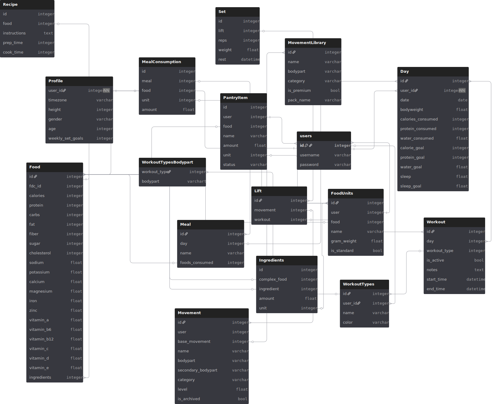

# Self Statistics

> A Data Driven, all encompassing health dashboard. Gamified to help addict you to your own goals.

# Feature Showcase

3 Apps in 1! 
1. Food tracking made easy -> humans eat the same few items, turn them into a template; only need to track macros once!
2. Workout tracking; start monitoring a lift and receive progression insights along with custom workout plans.
3. Health modeling; with all your data in one place, receive statistics not found in any other application.

## AIO Statistics

- Time series analytics for bodyweights, calorie consumption, and strength (daily, weekly, monthly, moving average, summary statistics) 
- Automated daily goals for Macros, Minerals, Vitamins, Sleep, Water, & Physical activity based on Bodyweight/Height/Gender; everything you need to live a healthy life without any of the hassle of figuring it out yourself. 

See how your meals impact your lifts, or your lifts impact your meals, or how your bodyweight impacts either; with everything in one place, all these variables can be used for predictions, with more to come! 

ML forecasting; each user receives a personalized model on their information tracked. This enables users to forecast how their body might responds to potential diets, workout plans, or time off from the gym; "if i decrease calories by 200 for the next 8 weeks, what would my bodyweight/strength look like." This enables trial running diets/workouts/events before you spend time doing them!

## Food Companion

Humans tend to eat the same few things day in and day out, the food companion capitalizes on this to streamline macro tracking.

- Track your macros manually and turn your meal into a template to easily add again and again on any day.
- Add a meal based on its consituient ingredients; simply search each ingredient and attach them to your meal, then you only need to enter the serving size you consumed!
(ingredients/foods imported from USDA FoodData)
- Attach a recipe to a templated meal; each day you can receive a meal plan based on your recipes and target macros, which then gives you a daily grocery list to ensure you have everything you need to hit the days macro goal! (MCP integration for automatic ordering groceries to your door coming soon) 

## Workout Log

- See all your workouts you have completed in your life in a 'match history' style.
- Start tracking a particular lift to see and save your progression
- Create custom workout plans for any body part or machine

# Download

`git clone https://github.com/ggneilc/self-statistics.git`

`cd self-statistics/`

`python -m venv env`

`. ./env/bin/activate`

`pip install -r requirements.txt`

`. ./load_env dev`

`python manage.py migrate` (test to see if any changes to database has been made with most recent commit) 

You can now run the development server from `self-statistics/` with `python manage.py runserver`. 

Keep in mind the database file (`db.sqlite3`) is only tracked for the initial repository upload so that dummy data could exist. 

---

# Demonstrated Skills

## Database Management

- Entity Relations
- ORM
- SQL
- Query Optimization
- Caching

## Backend Development

- REST Api development
- Django framework
- Environment management / Secrets (env variables, venv) 
- Server-side Templates (increase SEO)
- 3rd Party API integrations (USDA FoodData) 

## Frontend Development

Everything is done without frameworks to better learn the base tools for website design
- HTML
- CSS
- Javascript w/ HTMX

## AI/ML, Data Science

- Numerical Time series modelling and predictions (IMA, ARIMA)
- Summary Statistics for a given random variable
- Autoregressive Transformer for forecasting
- CNN for image classification (nutrition label parsing)
- MCP agentic integration (coming soon)
