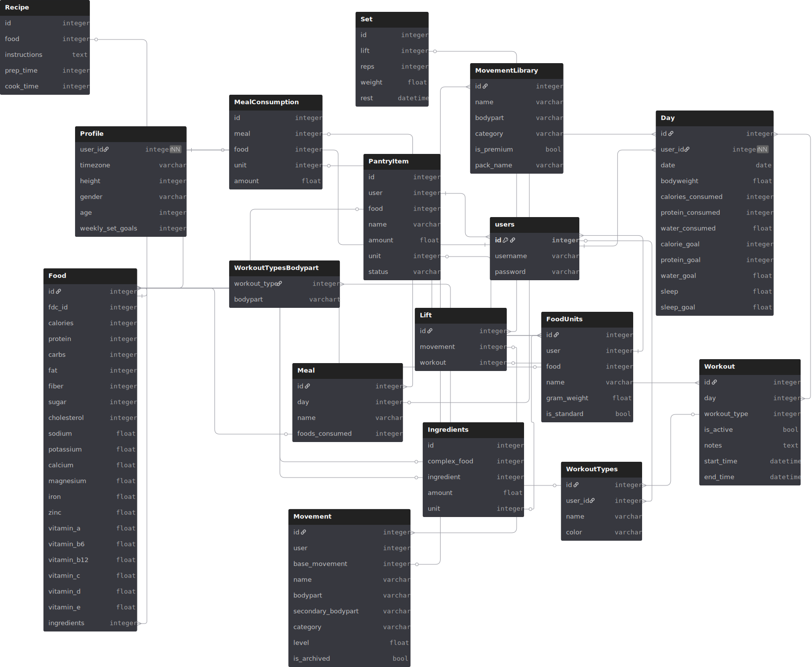

# Self Statistics
#### The High-Fidelity Health Engine

> "What gets measured, gets managed." Self-Statistics is an all-encompassing health dashboard designed to gamify habit formation and provide predictive modeling usually reserved for professional athletes and data scientists.


# Core Features

> Having separate apps for calorie counting, recipe storage, workouts, sleep, bodyweight, steps, ... is too much of a hassle. With all of these in one place, unlock the ability to truly see how biometrics impact each other: Your true 'day at a glance.' 

## Intelligent Nutrition Ecosystem

Most trackers fail because of friction. Self-Statistics treats food as a full-spectrum nutritional data model — not just calories and macros:
1. **Three Input Paths**: Import from the USDA FoodData Central API (with branded vitamin ID fallbacks and Atwater 4-9-4 calorie imputation), compose custom foods from existing ingredients with automatic per-100g normalization, or log manual entries with full micronutrient panels.
2. **Deep Nutrient Model**: Every `Food` stores macros, minerals, and vitamins normalized to 100g, with a `FoodUnit` system that maps named servings (cups, slices, scoops) to gram weights for accurate scaling at consumption time.
3. **Composite Food Engine**: Build recipes from atomic ingredients — the system aggregates all nutrients from the ingredient list, normalizes the result to per-100g, and generates an "as prepared" unit matching the total batch weight.
4. **RDA-Relative Visualization**: D3 donut charts render macro composition, mineral intake, and vitamin intake as ratios against Recommended Daily Allowance targets, personalized by the user's age and gender profile.
5. **Pantry & Inventory**: Track quantity and stock status with automatic threshold heuristics (in stock / low / out), per-user custom units, and inline HTMX editing — all backed by `select_related`/`Prefetch` strategies to eliminate N+1 queries.
6. **Recipe Layer**: Attach structured instructions, prep time, and cook time to any user-owned composite food, surfaced alongside the ingredient breakdown in accordion UIs.

## Engineered Workouts

Track any movement you want: Self-Statistics treats training as a structured, signal-driven data pipeline:
1. **Relational Session Architecture**: Workouts are typed (Push/Pull/Legs/Custom) with mapped target muscle groups, feeding into a `WorkoutType → Workout → Lift → Set` hierarchy that enables deep aggregation.
2. **Dual Movement System**: A curated global Movement Library seeds new users with a "Starter Pack," while fully custom movements let advanced lifters track anything — with soft-archiving so historical data is never lost.
3. **Weekly Volume Accountability**: Per-muscle set counts are maintained in real-time via Django signals and compared against a configurable weekly goal, surfaced as progress bars so you always know if you're under-training a muscle group.

## Predictive Biomechanics

Don't just look at the past; forecast the future. With everything in one place, you can truly see how everything you do is intertwined. 
1. **Automatic Metric Calculation**: Every day receives automatic daily allowances for all nutrients based on your current standings; gender, weight, height, and activity.
2. **ML Forecasting**: Uses Autoregressive Transformers and ARIMA models to predict bodyweight and strength responses to caloric shifts.
3. **Biometric Correlation**: See how 50mg of Magnesium impacts your sleep quality, or how a 200kcal deficit impacts your Bench Press 1RM

## Gamified Progression

Focus on leveling up the true main character in the game of life.
1. Built-in "XP" and "Quest" systems turn the grind of a caloric deficit into a leveling experience.
2. Visualize your "Match History" for every lift you've performed since Day 1.
3. Level up lifts everytime you perform them 
4. Receive real life buffs and debuffs for foods you eat and what you did during the day. 

> Leveling is intrisinc to the amount of data you've inputted; as you level up, you'll unlock more features of the app. 


# Download 

## Development Setup

1. Clone & Setup Environment
```
git clone https://github.com/ggneilc/self-statistics.git && cd self-statistics
python -m venv env && source env/bin/activate
pip install -r requirements.txt
```

2. Database & Dev environment
```
source ./load_env.sh dev
python manage.py migrate
```

3. Running Server

```
python manage.py runserver
```

to then perform mobile testing, run

`ngrok http 8000`

---

# Demonstrated Skills

## Backend & System Architecture

- High-Performance ORM: Implemented advanced `prefetch_related` and `select_related` strategies — including shaped `Prefetch` objects with filtered querysets — to solve the N+1 Query Problem across pantry, meal, and workout dashboard views.
- Multi-Tenant Data Isolation: Engineered custom object managers (`FoodManager`, `FoodUnitManager`) using Django Q Objects to merge global data with user-specific data while maintaining strict row-level security.
- Signal-Driven Data Pipeline: Built a `post_save`/`post_delete` signal architecture that automatically derives calorie goals (Harris–Benedict), rolls up daily nutrition totals, materializes weekly muscle-volume aggregates, adjusts gamification levels, and provisions new users with default workout types and a starter movement library — all without manual recalculation.
- External API Resilience: Developed a robust USDA FoodData Central integration that handles branded vitamin ID fallbacks with IU→µg conversion, Atwater 4-9-4 calorie imputation when energy data is missing, and schema mismatches between search indexes and detail databases.
- Layered Settings Architecture: Separated configuration into `base.py`, `dev.py`, `prod.py`, and `ci.py` modules with an environment switcher script, supporting SQLite in development, PostgreSQL with SSL/secure cookies in production, and in-memory SQLite with a fixed secret key in CI.
- HTMX Integration: Leveraged HTMX to create a single-page application (SPA) feel using server-side templates, eliminating the need for heavy JavaScript frameworks (React/Vue).

## Frontend & UX Engineering

- D3.js Data Visualization: Built interactive donut charts for macro composition, mineral intake, and vitamin intake — rendered as RDA-relative ratios personalized by the user's age and gender profile, with drill-down (e.g. carbs → sugar/fiber/starch) and center labels.
- Event-Driven UI Architecture: Implemented a toast notification bridge in the base template that listens for `HX-Trigger` events (`mealCreated`, `pantryItemAdded`, `workoutTypeCreated`, `bodyweightUpdated`, etc.) to provide cross-component feedback without coupling.
- Progressive Web App: Dynamic manifest generation, service worker with root scope, and a custom management command that uses Pillow to generate 192px and 512px icons from a source favicon.
- HTMX-Aware Authentication: Custom `HTMXLoginView`/`HTMXLogoutView` that return `HX-Redirect` headers when requests originate from HTMX, preventing partial-swap rendering of full-page redirects.
- Global Date State Injection: A single `htmx:configRequest` listener injects `selected_date` into every HTMX request, enabling all partials (meals, workouts, weekly sets) to stay synchronized to the user's selected calendar day.
- Resilient Client-Side Timers: Workout elapsed time and rest timers persist start timestamps in `localStorage`, surviving HTMX swaps and page navigations; rest timer writes ISO-8601 durations back to form fields.
- HTML5 Drag-and-Drop: Native DnD API for reordering lifts within an active workout session.

## Domain Logic & Data Science

- Harris–Benedict BMR Derivation: Calorie and protein goals are auto-calculated from bodyweight and profile data via signals on `Day` creation, using `.filter(pk=...).update()` to avoid infinite signal loops.
- Composite Food Normalization: When a user builds a food from ingredients, the system aggregates all nutrients from the ingredient list in grams, normalizes the result to per-100g, and generates an "as prepared" unit matching the total batch weight.
- Hybrid Food Classifier: Categorizes foods using a multi-pass strategy — keyword lexicon matching against name tokens, then macro-calorie dominance analysis, then carb subtype breakdown (fiber/sugar/starch).
- Brzycki 1RM Estimation: Every logged lift computes an estimated one-rep max from its best set, graphed over time to visualize long-term strength progression.
- Pandas/NumPy Analytics Pipeline: Graphs app builds DataFrames from ORM querysets with 7-day rolling averages, weekly resampling, acute-to-chronic workload ratios (ACWR), volume coefficient of variation, and `NaN`→`None` conversion for JSON-safe chart payloads.
- Time-Series Modeling: Automated forecasting for bodyweight and macro trends.
- Computer Vision: Integrated a CNN for parsing nutrition labels from raw images.
- Agentic Integration: Currently developing MCP (Model Context Protocol) integrations for autonomous grocery ordering.

## Testing & CI/CD

- Domain-Heavy Unit Tests: Test suites covering Harris–Benedict signal edge cases (no bodyweight, profile changes), nutrition scaling math, meal aggregation, composite food pipelines, `to_formatted_dict` contracts, default workout type provisioning, and soft-delete vs cascade behavior.
- GitHub Actions Pipeline: Automated CI with `coverage run`, markdown summary generation, HTML artifact upload, and a `--fail-under=50` coverage gate.

## Entity Relations


